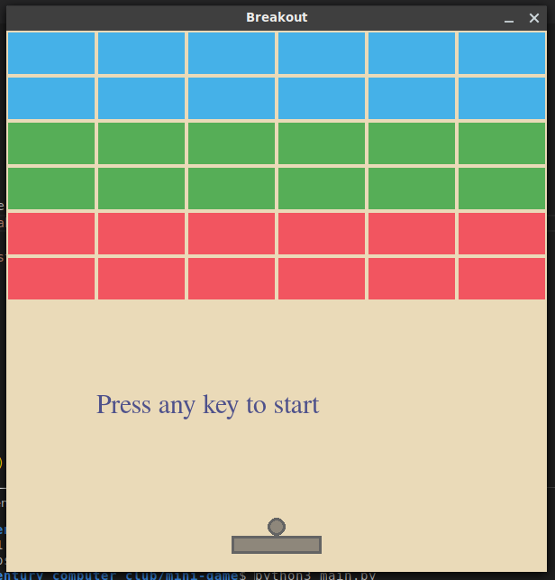

# Breakout Mini game


### Usage
```shell
pip3 install pygame
python3 main.py
```

*or with virtual environments:*

```shell
python3 -m venv .venv
source .venv/bin/activate
pip3 install pygame
python3 main.py
```

### Credits
The original code was taken from https://github.com/MatthewTamYT/Breakout